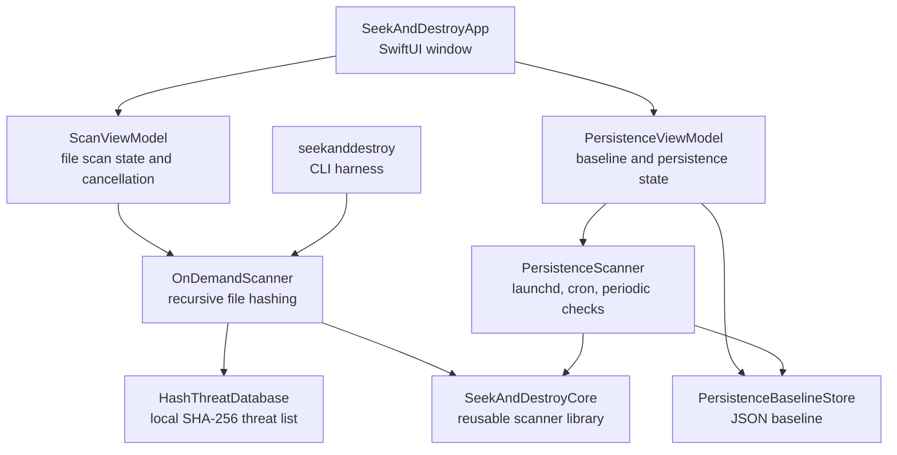

# SeekAndDestroy

SeekAndDestroy is a learning-first macOS antivirus and anti-malware project for Apple Silicon. The current app is not a production AV engine. It is a native Swift and SwiftUI playground for building the security primitives step by step: file hashing, local detection rules, persistence inspection, baseline comparison, and eventually code-signing checks, YARA, quarantine, and real-time monitoring.

The goal is to make macOS security internals concrete. Each phase should explain the security concept first, then implement a simplified but real version in code.

## Current Status

Implemented:

- SwiftPM project with macOS 14+ support.
- SwiftUI macOS app target: `SeekAndDestroyApp`.
- CLI target: `seekanddestroy`.
- Reusable core library target: `SeekAndDestroyCore`.
- Phase 1 file scanner:
  - Recursive directory scanning.
  - Streaming SHA-256 hashing with `CryptoKit`.
  - Local malicious hash list.
  - EICAR test-file hash detection.
  - Live scanned/skipped/finding lists in the UI.
  - Stop button with cooperative cancellation.
- Phase 2 persistence scanner:
  - LaunchAgents and LaunchDaemons.
  - cron files and cron tab directories.
  - periodic script directories.
  - best-effort configuration profile and login-item location checks.
  - local baseline save and compare.
  - new, changed, known, and no-baseline statuses.
  - basic persistence risk flags.
  - code-signing enrichment for persistence executables.

Planned next:

- Phase 1 completion: code signature validation with Security.framework.
- Phase 3: YARA integration.
- Phase 4: FSEvents monitoring as an Endpoint Security Framework substitute.
- Phase 5: quarantine and restore.
- Phase 6: signing, notarization, and basic self-protection.
- Phase 7: Endpoint Security entitlement and wider-distribution notes.

## Requirements

- Apple Silicon Mac.
- macOS 14 or newer.
- Xcode command line tools or Xcode.
- Swift 6 toolchain compatible with the package.

Check Swift:

```sh
swift --version
```

## Quick Start

Clone the repo:

```sh
git clone https://github.com/elangbamjohnson/SeekAndDestroy.git
cd SeekAndDestroy
```

Build and test:

```sh
swift build
swift test
```

Run the SwiftUI app:

```sh
swift run SeekAndDestroyApp
```

Run the CLI scanner:

```sh
swift run seekanddestroy
```

With no arguments, the CLI scans:

- `~/Downloads`
- `~/Desktop`
- `/Applications`

Scan specific paths:

```sh
swift run seekanddestroy ~/Downloads ~/Desktop /Applications
```

## Safe Detection Test

The bundled local hash list includes the SHA-256 hash of the harmless EICAR antivirus test string. This is useful for proving the detection path works without using real malware.

Create a test file:

```sh
mkdir -p /tmp/seekanddestroy-test
printf 'X5O!P%%@AP[4\\PZX54(P^)7CC)7}$EICAR-STANDARD-ANTIVIRUS-TEST-FILE!$H+H*' > /tmp/seekanddestroy-test/eicar.com
```

Test with the CLI:

```sh
swift run seekanddestroy /tmp/seekanddestroy-test
```

Expected result:

```text
Scanned files: 1
Skipped files: 0
Findings: 1
[malicious-hash] EICAR-Test-File ...
```

To see it in the UI, copy the file into a selected scan location:

```sh
cp /tmp/seekanddestroy-test/eicar.com ~/Downloads/eicar.com
swift run SeekAndDestroyApp
```

Then keep `Downloads` enabled and click `Scan`.

## App Workflow

The SwiftUI app has two modes.

### File Scan

Use this for Phase 1 on-demand scanning.

- Select `Downloads`, `Desktop`, and/or `Applications`.
- Click `Scan`.
- Watch live file names appear under:
  - `Scanned`
  - `Skipped`
  - `Findings`
- Click `Stop` to cancel between files.

### Persistence

Use this for Phase 2 persistence inspection.

- Click `Scan Persistence` to inspect persistence locations.
- Click `Save Baseline` when you trust the current state.
- Later scans compare current persistence items against that baseline.

Baseline statuses:

- `No Baseline`: no saved baseline was loaded.
- `Known`: item matches the saved baseline.
- `New`: item was not present in the saved baseline.
- `Changed`: item existed before but the source or executable hash changed.

The baseline file is stored under the current user's Application Support directory:

```text
~/Library/Application Support/SeekAndDestroy/persistence-baseline.json
```

## Architecture



## Technology Stack

- Swift
- SwiftUI
- SwiftPM
- Foundation
- CryptoKit
- macOS Security concepts under active development:
  - SHA-256 hashing
  - launchd persistence
  - baseline comparison
  - persistence executable code-signing validation
  - YARA integration, planned
  - FSEvents monitoring, planned
  - Endpoint Security Framework, documented later

## Source Map

```text
Package.swift
Sources/
  SeekAndDestroyApp/
    App/
      SeekAndDestroyApp.swift      macOS SwiftUI app entry point
    Views/
      ContentView.swift            main UI, mode switch, scan controls
      PersistenceView.swift        Phase 2 persistence UI
    ViewModels/
      ScanViewModel.swift          Phase 1 file scan UI state
      PersistenceViewModel.swift   baseline and persistence scan UI state
  SeekAndDestroyCore/
    Domain/
      Scanning/                    file scan models and progress events
      Persistence/                 persistence item and result models
    Application/
      Scanning/                    recursive scan orchestration
      Persistence/                 persistence scan orchestration
    Infrastructure/
      Hashing/                     streaming SHA-256 hashing
      ThreatIntel/                 local hash list loader
      Baseline/                    baseline JSON store
      CodeSigning/                 Security.framework signature inspection
    Support/                       preserved local support files
    Resources/ThreatIntel/
      malicious_hashes.txt         local malicious hash list
  seekanddestroy/
    main.swift                     CLI entry point
Tests/
  SeekAndDestroyCoreTests/
    Application/
    Infrastructure/
```

## How Detection Works Today

### SHA-256 Hash Matching

The file scanner recursively walks selected directories, reads each regular readable file in chunks, computes a SHA-256 hash, and checks that hash against the bundled local threat list.

Why this matters:

- Hash matching is deterministic.
- It is easy to test safely.
- It catches only exact known bytes.

What real AV products add:

- code-signing trust evaluation
- reputation
- behavioral signals
- YARA or pattern matching
- sandbox or detonation analysis
- real-time telemetry

### Persistence Baseline Comparison

The persistence scanner inspects common macOS persistence locations and turns each discovered entry into a normalized `PersistenceItem`. A saved baseline captures trusted items. Future scans compare current items against that baseline.

Why this matters:

- macOS malware often survives reboot through launchd jobs, cron, periodic scripts, login items, or profiles.
- Many persistence entries are legitimate.
- A baseline helps separate "normal for this Mac" from "new or changed."

What real AV products add:

- Endpoint Security Framework event monitoring
- richer login-item APIs
- configuration profile parsing
- code-signing and notarization checks
- vendor and Team ID reputation
- cloud lookups

## Current Risk Flags

Persistence items may be flagged when they look unusual:

- executable runs from `Downloads` or `Desktop`
- executable runs from temporary directories
- `com.apple.*` label appears outside system locations
- LaunchDaemon lives outside system locations
- referenced executable is missing
- executable is unsigned
- executable is ad-hoc signed
- executable has an invalid code signature

These are suspicion signals, not final malware verdicts.

## Privacy And Permissions

The current scanner reads files from locations you select in the app or pass to the CLI. Some locations may be skipped because macOS privacy controls or filesystem permissions prevent access.

For broader personal scanning later, the app may need:

- Full Disk Access
- Developer ID signing
- notarization
- a privileged helper for selected operations
- Endpoint Security entitlement if true real-time protection is added

## Safety Rules

- The app does not auto-delete files.
- The app does not quarantine files yet.
- The EICAR test file is safe and used only for detection testing.
- Findings should be reviewed before taking action.

## Development Commands

Build:

```sh
swift build
```

Test:

```sh
swift test
```

Run UI:

```sh
swift run SeekAndDestroyApp
```

Run CLI:

```sh
swift run seekanddestroy
```

## Roadmap

### Phase 1: On-Demand Scanner Core

Done:

- recursive directory scanner
- SHA-256 hashing
- local malicious hash list
- EICAR hash test
- SwiftUI scan button
- live scan updates
- stop button

Next:

- Security.framework code-signing validation with `SecStaticCodeCheckValidity`
- flag unsigned or ad-hoc signed executables in suspicious locations

### Phase 2: Heuristics And Persistence Scanner

Done:

- LaunchAgents and LaunchDaemons
- cron and periodic scripts
- baseline save/load/compare
- persistence risk flags
- code-signing details for persistence executables

Next:

- richer login-item inspection
- profile parsing

### Phase 3: YARA Integration

Planned:

- evaluate libyara C interop from Swift
- add a small rule set
- show YARA matches in the UI

### Phase 4: Real-Time-ish Monitoring

Planned:

- FSEvents watcher on user directories
- explain the gap between FSEvents and Endpoint Security Framework

### Phase 5: Quarantine And Remediation

Planned:

- move-to-quarantine
- manifest
- restore capability
- never auto-delete

### Phase 6: Self-Protection And Packaging

Planned:

- Developer ID signing
- notarization
- hardened runtime
- integrity checks for local DB and rules

### Phase 7: Endpoint Security Future

Planned documentation:

- Endpoint Security architecture
- entitlement requirements
- event coverage
- what would change for wider distribution

## License

No license has been selected yet.
